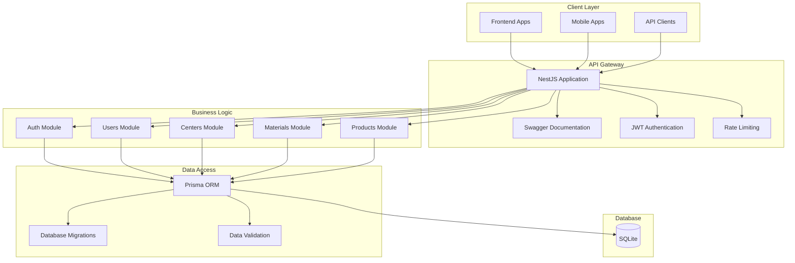
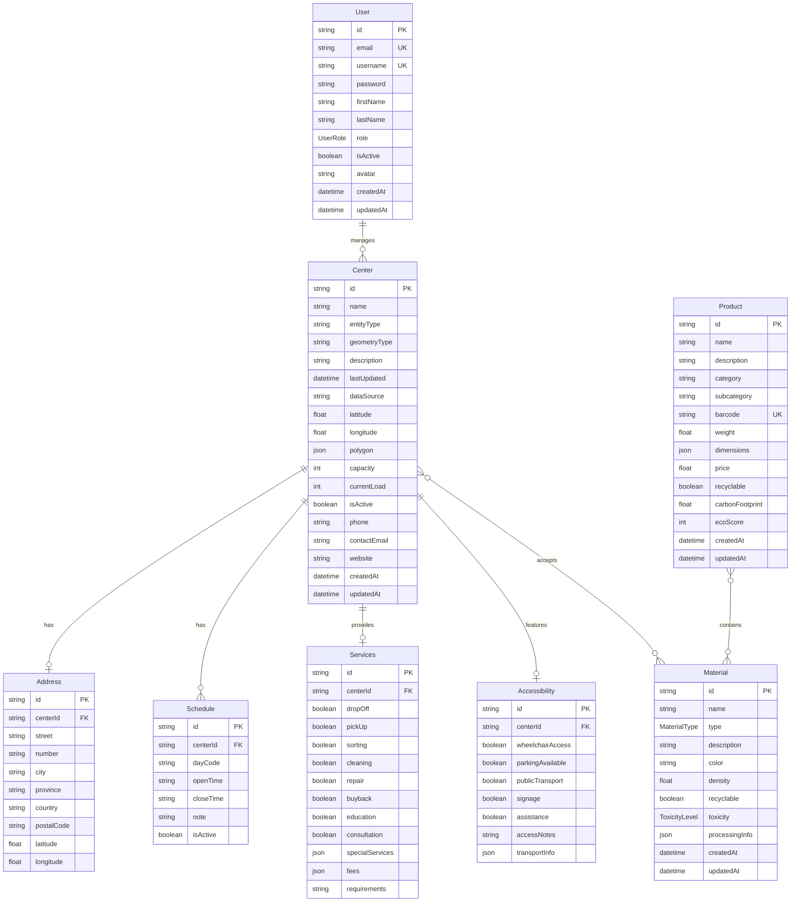

# 🧬 Bioblio API

> **Scientific knowledge base API for managing molecules, proteins, reactions, and articles**
> 
> *Created by the Wealthiest Programmer in the Universe 💎*

## 🏗️ Architecture Overview

This application follows a modular architecture pattern with clear separation of concerns, ensuring maximum scalability and maintainability.



## 📊 Entity Relationship Diagram



## 🚀 Features

### 🔐 Authentication & Authorization
- JWT-based authentication
- Role-based access control (Admin, Manager, User)
- Password hashing with bcrypt
- Token refresh mechanism
- Protected routes with guards

### 👤 User Management
- User registration and login
- Profile management
- Role assignment
- Account activation/deactivation
- Comprehensive user statistics

### 🏢 Center Management
- CRUD operations for recycling centers
- Geolocation and mapping support
- Schedule management
- Service tracking
- Accessibility features
- Material acceptance tracking

### ♻️ Material Management
- Material type classification
- Toxicity level tracking
- Recyclability status
- Processing information
- Center-material relationships

### 📦 Product Management
- Product catalog
- Environmental impact tracking
- Material composition
- Recyclability assessment
- Barcode integration

### 🔍 Advanced Features
- Pagination and filtering
- Full-text search
- Geospatial queries
- Statistical reporting
- API documentation with Swagger
- Rate limiting
- Input validation

## 🛠️ Technology Stack

- **Framework**: NestJS (Node.js)
- **Database**: SQLite (Embedded)
- **ORM**: Prisma
- **Authentication**: JWT + Passport
- **Validation**: Class Validator & Class Transformer
- **Documentation**: Swagger/OpenAPI
- **TypeScript**: Full type safety
- **Testing**: Jest

## 📁 Project Structure

```
src/
├── main.ts                 # Application entry point
├── app.module.ts          # Root module
└── modules/
    ├── prisma/            # Database service
    │   ├── prisma.module.ts
    │   └── prisma.service.ts
    ├── auth/              # Authentication
    │   ├── auth.module.ts
    │   ├── auth.service.ts
    │   ├── auth.controller.ts
    │   ├── dto/
    │   ├── guards/
    │   ├── strategies/
    │   └── decorators/
    ├── users/             # User management
    │   ├── users.module.ts
    │   ├── users.service.ts
    │   ├── users.controller.ts
    │   └── dto/
    ├── centers/           # Center management
    │   ├── centers.module.ts
    │   ├── centers.service.ts
    │   ├── centers.controller.ts
    │   └── dto/
    ├── materials/         # Material management
    │   ├── materials.module.ts
    │   ├── materials.service.ts
    │   ├── materials.controller.ts
    │   └── dto/
    └── products/          # Product management
        ├── products.module.ts
        ├── products.service.ts
        ├── products.controller.ts
        └── dto/
```

## ⚙️ Installation & Setup

### Prerequisites
- Node.js (v18 or higher)
- npm or yarn

### 1. Install Dependencies
\`\`\`bash
npm install
\`\`\`

### 2. Environment Configuration
Copy the environment example file and update the values:
\`\`\`bash
cp .env.example .env
\`\`\`

Update your `.env` file with your database configuration:
\`\`\`env
DATABASE_URL="file:./dev.db"
JWT_SECRET="your-super-secret-jwt-key-change-in-production"
JWT_EXPIRES_IN="24h"
NODE_ENV="development"
PORT=3001
\`\`\`

### 3. Database Setup

#### Generate Prisma Client
\`\`\`bash
npx prisma generate
\`\`\`

#### Initialize Database
\`\`\`bash
# Create and apply migration (SQLite database will be created automatically)
npx prisma migrate dev --name init

# Or push schema directly (for development)
npx prisma db push
\`\`\`

#### Seed Database (Optional)
\`\`\`bash
npx prisma db seed
\`\`\`

### 4. Start the Application

#### Development Mode
\`\`\`bash
npm run start:dev
\`\`\`

#### Production Mode
\`\`\`bash
npm run build
npm run start:prod
\`\`\`

The API will be available at:
- **API**: http://localhost:3001/api/v1
- **Swagger Documentation**: http://localhost:3001/api/docs

## 🗃️ Database Migrations

### Create New Migration
\`\`\`bash
npx prisma migrate dev --name migration_name
\`\`\`

### Apply Migrations in Production
\`\`\`bash
npx prisma migrate deploy
\`\`\`

### Reset Database (Development Only)
\`\`\`bash
npx prisma migrate reset
\`\`\`

### View Database
\`\`\`bash
npx prisma studio
\`\`\`

## 🧪 Testing with Postman

### 1. Import Collection
Create a new Postman collection with the following base URL:
\`\`\`
{{baseUrl}} = http://localhost:3001/api/v1
\`\`\`

### 2. Authentication Flow

#### Register a New User
\`\`\`http
POST {{baseUrl}}/auth/register
Content-Type: application/json

{
  "email": "admin@example.com",
  "username": "admin",
  "password": "password123",
  "firstName": "Admin",
  "lastName": "User"
}
\`\`\`

#### Login
\`\`\`http
POST {{baseUrl}}/auth/login
Content-Type: application/json

{
  "email": "admin@example.com",
  "password": "password123"
}
\`\`\`

Save the `accessToken` from the response and use it in subsequent requests.

### 3. Add Authorization Header
For protected endpoints, add the Authorization header:
\`\`\`
Authorization: Bearer {{accessToken}}
\`\`\`

### 4. Test Endpoints

#### Get User Profile
\`\`\`http
GET {{baseUrl}}/auth/profile
Authorization: Bearer {{accessToken}}
\`\`\`

#### Create a Material
\`\`\`http
POST {{baseUrl}}/materials
Authorization: Bearer {{accessToken}}
Content-Type: application/json

{
  "name": "PET Plastic Bottle",
  "type": "PLASTIC",
  "description": "Clear plastic bottles used for beverages",
  "color": "Clear",
  "density": 1380,
  "recyclable": true,
  "toxicity": "LOW"
}
\`\`\`

#### Create a Center
\`\`\`http
POST {{baseUrl}}/centers
Authorization: Bearer {{accessToken}}
Content-Type: application/json

{
  "name": "EcoCenter Madrid Norte",
  "entityType": "Municipal",
  "geometryType": "Point",
  "description": "Large municipal recycling center",
  "dataSource": "Municipal Database",
  "latitude": 40.4168,
  "longitude": -3.7038,
  "phone": "+34 912 345 678",
  "contactEmail": "info@ecocenter-madrid.es",
  "address": {
    "street": "Calle Mayor",
    "number": "123",
    "city": "Madrid",
    "province": "Madrid",
    "country": "Spain",
    "postalCode": "28001"
  },
  "schedules": [
    {
      "dayCode": "MON",
      "openTime": "08:00",
      "closeTime": "18:00"
    },
    {
      "dayCode": "TUE",
      "openTime": "08:00",
      "closeTime": "18:00"
    }
  ],
  "services": {
    "dropOff": true,
    "sorting": true,
    "education": true
  },
  "accessibility": {
    "wheelchairAccess": true,
    "parkingAvailable": true,
    "publicTransport": true
  }
}
\`\`\`

#### Get All Materials with Filtering
\`\`\`http
GET {{baseUrl}}/materials?page=1&limit=10&type=PLASTIC&recyclable=true
Authorization: Bearer {{accessToken}}
\`\`\`

#### Get Centers Near Location
\`\`\`http
GET {{baseUrl}}/centers/location?latitude=40.4168&longitude=-3.7038&radius=10
Authorization: Bearer {{accessToken}}
\`\`\`

### 5. Postman Environment Variables
Create a Postman environment with these variables:
\`\`\`json
{
  "baseUrl": "http://localhost:3001/api/v1",
  "accessToken": "{{token_from_login_response}}"
}
\`\`\`

### 6. Test Data Examples

#### Sample Users
\`\`\`json
[
  {
    "email": "admin@example.com",
    "username": "admin",
    "password": "password123",
    "role": "ADMIN"
  },
  {
    "email": "manager@example.com",
    "username": "manager",
    "password": "password123",
    "role": "MANAGER"
  },
  {
    "email": "user@example.com",
    "username": "user",
    "password": "password123",
    "role": "USER"
  }
]
\`\`\`

#### Sample Materials
\`\`\`json
[
  {
    "name": "Aluminum Can",
    "type": "METAL",
    "recyclable": true,
    "toxicity": "LOW"
  },
  {
    "name": "Glass Bottle",
    "type": "GLASS",
    "recyclable": true,
    "toxicity": "LOW"
  },
  {
    "name": "Lithium Battery",
    "type": "BATTERY",
    "recyclable": true,
    "toxicity": "HAZARDOUS"
  }
]
\`\`\`

## 📚 API Documentation

Once the application is running, visit http://localhost:3001/api/docs to access the complete Swagger documentation with:
- Interactive API explorer
- Request/response schemas
- Authentication examples
- Error codes and descriptions

## 🔒 Security Features

- **JWT Authentication**: Secure token-based authentication
- **Role-Based Access Control**: Different permission levels
- **Password Hashing**: Bcrypt with salt rounds
- **Input Validation**: Comprehensive validation using class-validator
- **Rate Limiting**: Protection against abuse
- **CORS Configuration**: Secure cross-origin requests

## 🚀 Deployment

### Environment Variables for Production
\`\`\`env
NODE_ENV=production
DATABASE_URL="file:./production.db"
JWT_SECRET="very-secure-secret-key-in-production"
PORT=3001
\`\`\`

### Build for Production
\`\`\`bash
npm run build
npm run start:prod
\`\`\`

### Docker Deployment (Optional)
\`\`\`dockerfile
FROM node:18-alpine
WORKDIR /app
COPY package*.json ./
RUN npm ci --only=production
COPY . .
RUN npm run build
EXPOSE 3001
CMD ["npm", "run", "start:prod"]
\`\`\`

## 🤝 Contributing

1. Fork the repository
2. Create a feature branch
3. Make your changes
4. Add tests
5. Submit a pull request

## 📄 License

This project is licensed under the MIT License.

---

> **Created with 💎 by the Wealthiest Programmer in the Universe**
> 
> *"Code like you own the digital realm, because you do."*
